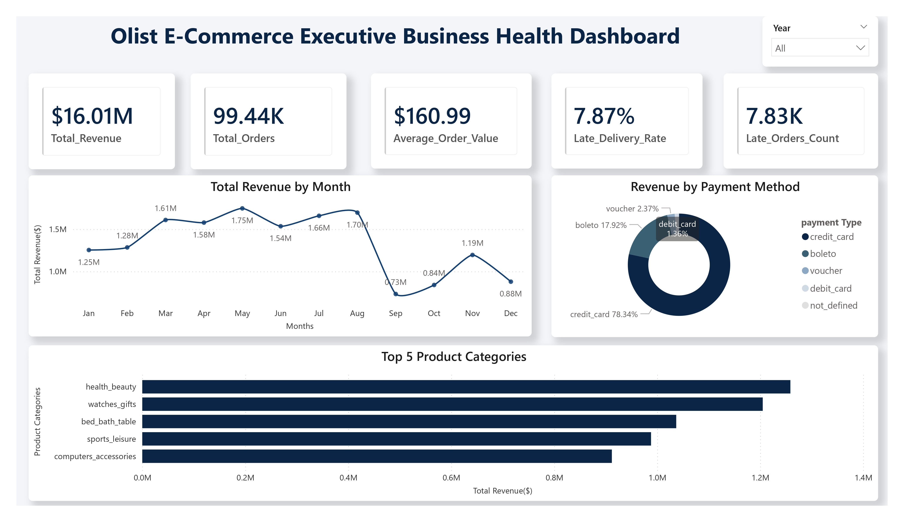
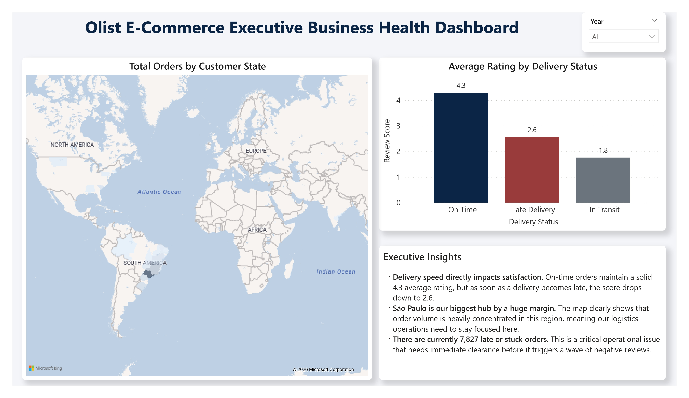

# Olist E-Commerce End-to-End Analytics Pipeline

## Dashboard Preview

### Executive Overview



### Logistics and Experience



## Project Overview

This project delivers a production-grade, end-to-end business intelligence and data engineering pipeline designed to evaluate macro e-commerce operations. By integrating multi-table relational databases, executing advanced SQL transformations, optimizing physical database infrastructure, and engineering comprehensive Power BI reporting layers, this framework translates over 1.5 million rows of transactional data into strategic enterprise decisions.

The final Power BI report includes:

- Executive Overview
- Logistics and Experience

## Business Problem

E-commerce leaders need to monitor sales performance, product categories, payment behavior, delivery performance, and customer experience. This project answers:

- How is revenue trending over time?
- Which product categories drive revenue?
- Which payment methods are most common?
- Which states face longer delivery times?
- How do late deliveries affect review scores?
- Which customers spend the most in each state?
- What operational factors affect satisfaction?

## Dataset

Main datasets:

- Customers: 99,441 rows
- Geolocation: 1,000,163 rows
- Orders: 99,441 rows
- Order Items: 112,650 rows
- Order Payments: 103,886 rows
- Order Reviews: 99,224 rows
- Products: 32,951 rows
- Sellers: 3,095 rows
- Product Category Translation: 71 rows

Total analysis scope: 1.5M+ rows.

## Tools Used

- SQL
- MySQL
- Power BI
- Power Query
- DAX

## Technical Workflow & Database Architecture

### 1. Data Transformation & Ingestion (ETL Layer)
Executed precise data cleaning and type enforcement directly within the MySQL instance to secure a trusted reporting layer:
* **Temporal & Numeric Standardization:** Converted raw string timestamps into native system datetime formats and transformed financial records (payment values, product prices, and freight costs) into explicit decimal formats.
* **Localization Mapping:** Resolved language variance by executing relational inner joins against the translation matrix, mapping Portuguese category fields into English designations.

### 2. Analytical Scripting & Query Optimization
Designed high-performance SQL workflows to decouple processing execution from the visualization tier:
* **Advanced Analytical Windows:** Deployed `DENSE_RANK()` windowing functions to isolate top-tier consumer cohorts within independent state boundaries and implemented cumulative running-totals to chart chronological revenue trends.
* **Infrastructure Tuning:** Generated targeted database indexes on primary query filter keys to accelerate join processing times, built dynamic database views to serve as decoupled data marts, and structured reusable stored procedures to automate recurring data aggregations.

### 3. Business Intelligence Architecture
Developed a dual-page interactive reporting solution inside Power BI:
* **Executive Overview:** Provides instant clarity on baseline revenues, category performance hierarchies, and payment type tracking via explicit DAX measures and temporal filters.
* **Logistics and Experience:** Integrates transit duration tracking against delivery success parameters, explicitly detailing how fulfillment latencies correlate with drops in consumer review scores.

## SQL Analysis Covered

- Total orders and payment value
- Monthly revenue trend
- Top product categories
- Payment method distribution
- Delivery time by state
- Late delivery impact on review score
- Top customers by state using DENSE_RANK
- Cumulative revenue using window functions

## Power BI Dashboard Pages

### Executive Overview

- Revenue trend
- Product category performance
- Payment type distribution
- Year slicer
- KPI cards

### Logistics and Experience

- Delivery status
- Customer state analysis
- Delivery experience
- Review impact
- Logistics performance

## Key Business Insights & Actionable Recommendations

* **Revenue Velocity & Portfolio Performance:** Clear structural identification of dominant, high-margin product categories and cyclical sales trajectories across multi-year periods.
  * *Business Analyst Recommendation:* Align procurement cycles with seasonal demand spikes identified in high-velocity product lines to minimize stock-outs and reduce warehousing overhead.
* **Fulfillment Latency Friction:** Validated a direct degradation of customer review scores when operational delivery transit windows exceed regional thresholds.
  * *Business Analyst Recommendation:* Restructure distribution center allocations or establish strict performance-based SLA triggers for logistics partners serving states with high transit latencies.
* **Financial Transaction Preferences:** Clear consumer concentration trends across specific transactional media (credit cards, bank slips, vouchers).
  * *Business Analyst Recommendation:* Launch point-of-sale promotions or co-branded financing options optimized around dominant payment types to improve final checkout conversion rates.

## Repository Structure
```text
olist-ecommerce-end-to-end-analytics-pipeline/
├── README.md                                          # Core Project Documentation
├── 01_raw_data/                                       # Transactional CSV Source Files
├── 02_sql_scripts/
│   ├── 01_data_cleaning_and_setup.sql                 # Data Type Casting & Initial Schema Setup
│   ├── 02_business_analysis_queries.sql               # Advanced Windowing & Analytical Joins
│   └── 03_database_optimization_and_automation.sql   # Indexes, Performance Views, and Stored Procedures
├── 03_powerbi/
│   └── dashboard.pbix                                 # Compiled Power BI Report Dashboard
├── 04_screenshots/
│   ├── 01_executive_overview.jpg                      # Strategic Executive View Snapshot
│   └── 02_logistics_experience.jpg                    # Logistics Performance & Sentiment Matrix
└── 05_docs/
    └── data_dictionary.md                             # Schema Definitions & Column Grain Metadata
```

## GitHub Upload Notes

- Include dashboard screenshots.
- Do not upload database passwords.
- If raw data is too large, upload sample data and mention the source link.

## Skills Demonstrated

- SQL Data Cleaning
- MySQL
- Joins and Aggregations
- CTEs
- Window Functions
- Views
- Indexes
- Stored Procedures
- Power BI Dashboarding
- Power Query
- DAX
- E-commerce Analytics
- Business Intelligence Reporting

## Future Improvements

- Advanced Customer Segmentation: Deploy RFM (Recency, Frequency, Monetary) clustering scripts to differentiate and target high-value consumer profiles.
- Predictive Delay Modeling: Engineer machine learning forecasting workflows to flag potential transit delays before orders leave fulfillment centers.
- Enterprise Cloud Synchronization: Transition the local file into the cloud-based Power BI Service to establish automated gateway refreshes and role-based row-level security (RLS).

