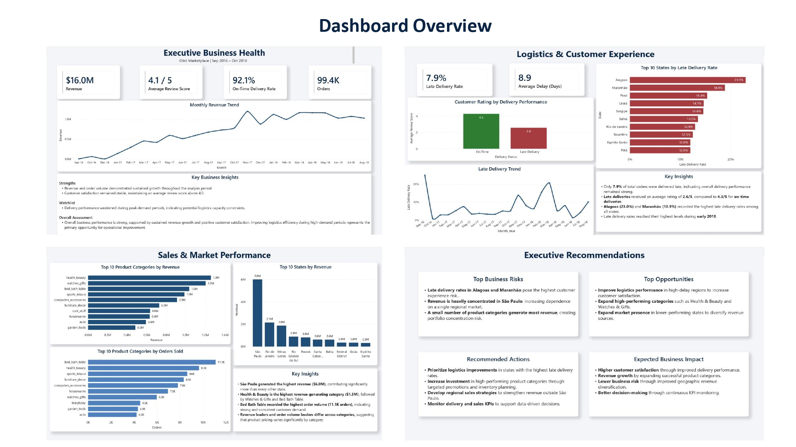
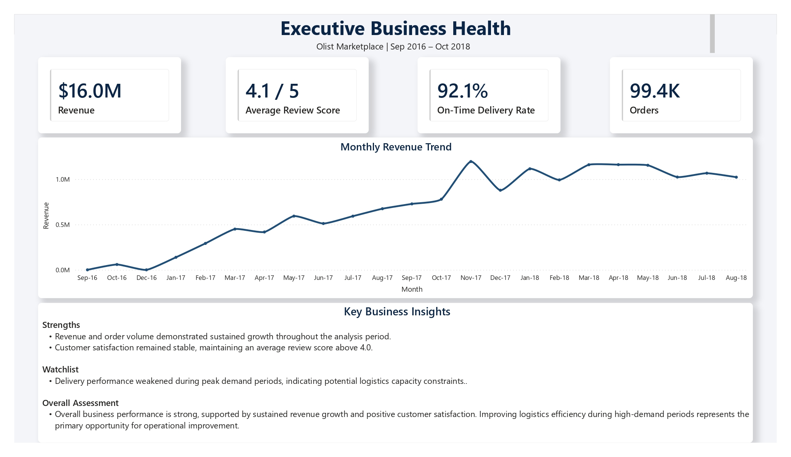
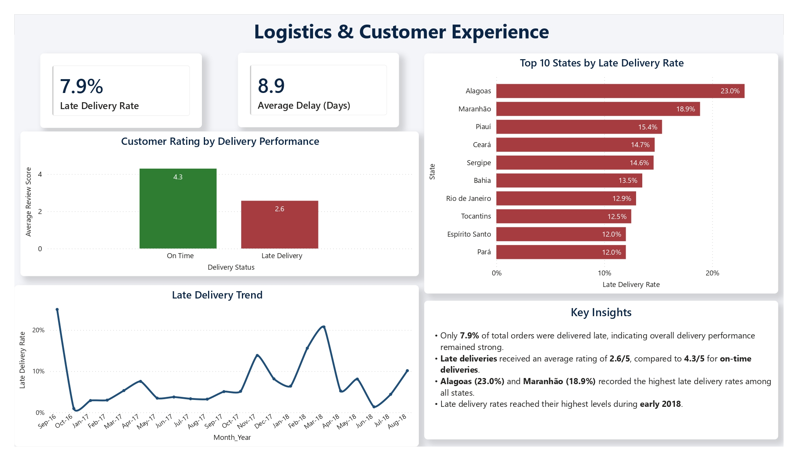
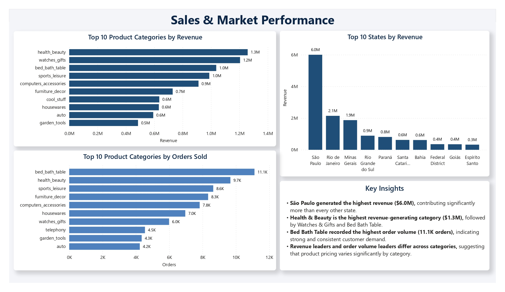
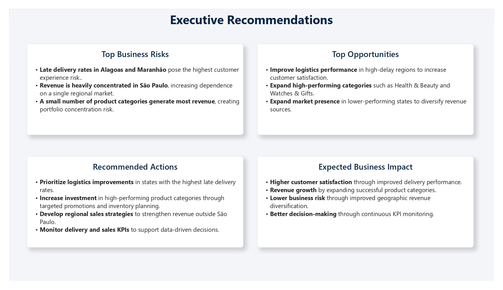
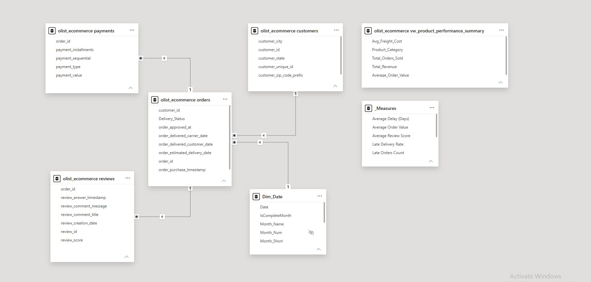

# Olist E-Commerce Business Performance Dashboard

A comprehensive Business Intelligence dashboard built in Power BI to analyze sales performance, logistics efficiency, customer satisfaction, and business growth opportunities using the Olist Brazilian E-Commerce dataset.

The project follows a complete analytics workflow including SQL data preparation, data modeling, DAX measure development, dashboard design, and executive-level business recommendations.

---

# Dashboard Overview

The dashboard is divided into four executive-focused report pages.

| Page | Focus Area |
|------|------------|
| Executive Business Health | Overall business KPIs and revenue trends |
| Logistics & Customer Experience | Delivery performance and customer satisfaction |
| Sales & Market Performance | Revenue contribution across states and product categories |
| Executive Recommendations | Business risks, opportunities and strategic recommendations |

---

# Dashboard Preview



---

# Dashboard Pages

## Page 1 — Executive Business Health



### Objectives

- Monitor overall business performance
- Track core executive KPIs
- Analyze monthly revenue trend
- Summarize overall business health

### KPIs

- Total Revenue
- Total Orders
- Average Review Score
- On-Time Delivery Rate

### Visuals

- Monthly Revenue Trend
- Executive KPI Cards
- Business Insight Summary

---

## Page 2 — Logistics & Customer Experience



### Objectives

- Evaluate delivery performance
- Understand customer satisfaction
- Identify operational bottlenecks
- Highlight logistics improvement opportunities

### KPIs

- Late Delivery Rate
- Average Delivery Delay

### Visuals

- Customer Rating by Delivery Status
- Top States by Late Delivery Rate
- Monthly Late Delivery Trend
- Logistics Insights

---

## Page 3 — Sales & Market Performance



### Objectives

- Identify revenue-driving markets
- Compare product category performance
- Understand geographic sales distribution
- Support product portfolio decisions

### Visuals

- Top States by Revenue
- Top Product Categories by Revenue
- Top Product Categories by Orders Sold
- Business Insights

---

## Page 4 — Executive Recommendations



### Objectives

Transform analytical findings into business decisions.

### Sections

- Top Business Risks
- Top Opportunities
- Recommended Actions
- Expected Business Impact

---

# Data Model

The dashboard follows a Star Schema model for efficient reporting and scalable analytics.



### Fact Tables

- Orders
- Payments
- Reviews

### Dimension Tables

- Customers
- Date

### SQL Business View

- vw_product_performance_summary

---

# Data Preparation

The dataset was prepared before visualization using SQL and Power Query.

### SQL

- Created business summary views
- Performed aggregations
- Generated category-level performance metrics

### Power Query

- Removed duplicates
- Corrected data types
- Cleaned missing values
- Standardized columns

### Data Modeling

- Implemented Star Schema
- Configured one-to-many relationships
- Created Date Dimension
- Optimized filter flow

---

# DAX Measures

Key business measures created for reporting include:

- Revenue
- Orders
- Average Order Value
- Average Review Score
- On-Time Delivery Rate
- Late Delivery Rate
- Average Delay (Days)
- Late Orders Count

---

# Key Findings

The analysis identified several business trends across sales, logistics, and customer experience.

- Revenue maintained a consistent upward trend throughout the analysis period, indicating sustained business growth.
- Customer satisfaction remained strong, with an average review score above **4.0**.
- Orders delivered on or before the estimated delivery date consistently received higher customer ratings than delayed orders.
- São Paulo generated the highest share of total revenue, indicating significant regional concentration.
- Health & Beauty emerged as the highest revenue-generating product category, while Bed Bath Table recorded the highest order volume.
- Revenue and order volume rankings differed across product categories, suggesting variations in average selling price and purchasing behavior.
- Delivery performance represents the largest operational opportunity for improving customer experience.

---

# Business Recommendations

The following recommendations are based on the findings from the dashboard.

### Improve Logistics Performance

Prioritize operational improvements in states with consistently high late delivery rates. Reducing delivery delays can improve customer satisfaction and strengthen the overall shopping experience.

### Expand High-Performing Categories

Increase marketing investment and inventory planning for product categories that consistently generate strong revenue while monitoring emerging categories with growth potential.

### Diversify Regional Revenue

Develop targeted sales strategies for lower-performing states to reduce dependency on a small number of high-revenue markets.

### Establish KPI Monitoring

Track revenue, delivery performance, and customer satisfaction on a regular basis to identify operational issues early and support data-driven decision-making.

---

# Technical Skills Demonstrated

This project demonstrates practical experience across the complete business intelligence workflow.

| Area | Skills Applied |
|------|----------------|
| Data Preparation | Data Cleaning, Data Validation, Data Transformation |
| SQL | Views, Aggregations, Business Summary Tables |
| Data Modeling | Star Schema, Relationship Management |
| Power BI | Interactive Dashboards, Report Design, Navigation |
| DAX | Business KPIs, Calculated Measures |
| Business Analytics | KPI Design, Trend Analysis, Executive Reporting, Business Recommendations |

---

# Repository Structure

```text
olist-ecommerce-end-to-end-analytics-pipeline/
├── README.md                                          
├── 01_raw_data/                                      
├── 02_sql_scripts/
│   ├── 01_data_cleaning_and_setup.sql                 
│   ├── 02_business_analysis_queries.sql               
│   └── 03_database_optimization_and_automation.sql   
├── 03_powerbi/
│   └── dashboard.pbix                                 
├── 04_images/
│   ├── dashboard-preview.jpg                      
│   ├── star-schema.png   
│   ├── page1.jpg
│   ├── page2.jpg
│   ├── page3.jpg
│   └── page4.jpg
└── 05_docs/
    └── data_dictionary.md                             
```

---

# Technologies Used

| Technology | Purpose |
|------------|---------|
| Power BI | Dashboard Development |
| SQL | Data Preparation & Business Views |
| DAX | KPI and Measure Development |
| Power Query | Data Cleaning & Transformation |
| Microsoft Excel | Initial Data Exploration |

---

# How to Run

1. Clone or download this repository.
2. Open the `.pbix` file using Microsoft Power BI Desktop.
3. Reconnect the dataset if required.
4. Refresh the data model.
5. Navigate through the four dashboard pages using the report tabs.

---

# Future Enhancements

Potential enhancements for future versions include:

- Profitability Analysis
- Customer Segmentation
- Seller Performance Dashboard
- Customer Retention Analysis
- Demand Forecasting
- Geographic Heat Maps
- Automated Data Refresh
- Executive Drill-through Pages

---

# About the Author

**Ankit Singh Rawat**

Aspiring Data Analyst focused on business intelligence, dashboard development, and data-driven decision-making.

### Technical Skills

- SQL
- Power BI
- DAX
- Power Query
- Microsoft Excel
- Python

### Connect

**GitHub:** https://github.com/1ankitrawat1

**LinkedIn:** https://www.linkedin.com/in/ankit-singh-rawat-data-analyst/

---

# Acknowledgements

This project uses the **Olist Brazilian E-Commerce Dataset**, which is publicly available for educational and analytical purposes.

Special thanks to the original dataset creators for making the data accessible to the data analytics community.

---

# License

This repository is intended for educational and portfolio purposes.

The dataset belongs to its respective creators and is used in accordance with its public availability.